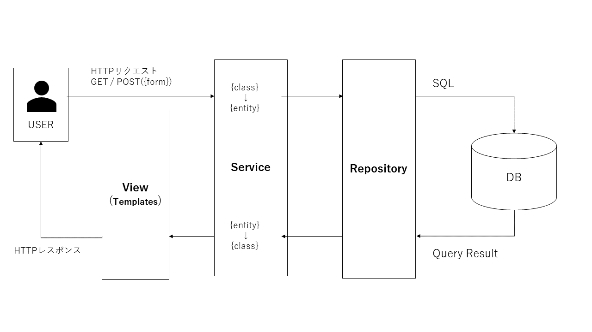

# the Elephant in the room
'the Elephant in the room' is my private PHP flame work.

#### ※ project code: Gladiolus
This project code is named "Gladiolus," inspired by its flower language of "unwavering effort" and "victory." Just as the gladiolus flower represents triumph through perseverance, this framework is crafted with the aim of guiding the passion and effort of engineers towards victory. The framework itself is designed to be simple yet flexible, allowing developers to customize it according to their own preferences and needs.

<br> since 2023.7.26


## 1. Artchitecture (Directory)


```
ROOT
│  .env
│  .gitignore
│  .htaccess
│  composer.json
│  composer.lock
│  index.php
│  Readme.md
│  
├─axis
│  │  App.php
│  │  Service.php
│  │  Template.php
│  │  
│  ├─database
│  │      DataBaseConnect.php
│  │      
│  ├─https
│  │      Request.php
│  │      Response.php
│  │      Validator.php
│  │      
│  ├─routes
│  │      Router.php
│  │      
│  └─toolbox
│      │  File.php
│      │  Mail.php
│      │  PDF.php
│      │  Session.php
│      │  
│      └─functions
│              date.php
│              fragile.php
│              pagination.php
│              
├─classes
│      PostRequest.php
│      UserRequest.php
│      
├─config
│      label.php
│      message.php
│      
├─interfaces
│  ├─classes
│  │      IPostRequest.php
│  │      IUserRequest.php
│  │      
│  ├─models
│  │  └─repositories
│  │          IPostRepository.php
│  │          IUserRepository.php
│  │          
│  └─services
│          IPostService.php
│          IUserService.php
│          
├─logs
│      error.log
│      
├─migrations
│  ├─csv
│  │  │  db_csv_input.php
│  │  │  db_csv_output.php
│  │  │  
│  │  └─csv
│  │      └─uploads
│  │              artists.csv
│  │              artist_concert.csv
│  │              concerts.csv
│  │              users.csv
│  │              
│  ├─jsonplaceholder
│  │      posts.php
│  │      users.php
│  │      
│  └─migrate
│          PostsTable.php
│          UsersTable.php
│          
├─models
│  ├─entities
│  │      PostEntity.php
│  │      UserEntity.php
│  │      
│  └─repositories
│          PostRepository.php
│          UserRepository.php
│          
├─public
│  └─assets
│      ├─css
│      │      common.css
│      │      js-parts.css
│      │      style.css
│      │      
│      ├─img
│      │      auth.png
│      │      db.png
│      │      elephant.jpg
│      │      home.png
│      │      mail.png
│      │      upload.png
│      │      
│      ├─js
│      │      script.js
│      │      
│      └─pdf
│              test.php
│              
├─services
│      PostService.php
│      UserService.php
│      
├─storage
│  └─doc
├─templates
│  │  welcome.php
│  │  
│  ├─errors
│  │      404.php
│  │      error.php
│  │      
│  ├─layouts
│  │      footer.php
│  │      header.php
│  │      
│  ├─post
│  │      create_form.php
│  │      index.php
│  │      update_form.php
│  │      
│  └─user
│          my_page.php
│          signin_form.php
│          signup_form.php
│          
├─tests
│  ├─classes
│  │      PostRequestTest.php
│  │      UserRequestTest.php
│  │      
│  ├─models
│  │  ├─entities
│  │  │      PostEntityTest.php
│  │  │      UserEntityTest.php
│  │  │      
│  │  └─repositories
│  │          PostRepositoryTest.php
│  │          UserRepositoryTest.php
│  │          
│  └─services
│          PostServiceTest.php
│          UserServiceTest.php
│          
└─vendor
    │  autoload.php
    │  
    ├─bin
    │      .phpunit.result.cache
    │      php-parse
    │      php-parse.bat
    │      phpunit
    │      phpunit.bat
    │      
    ├─composer
    │      
    ├─graham-campbell
    │              
    ├─guzzlehttp
    |
    ├─myclabs
    |
    ├─nikic
    │                      
    ├─phar-io
    │                  
    ├─phpoption
    │                  
    ├─phpunit

```

<br>


## 2. Clone Projectes & Install Packages

- Let's start by cloning the project.
    ```
    git clone https://github.com/sh-kikuchi/the-elephant-in-the-room.git
    ```

<br>

- After that, let's run `composer install`.
    ```
    composer install
    ```

<br>

## 3. Database
1. Set up the DB in '.env' in the project directory 
    ```
    DB_HOST = 'localhost'
    DB_NAME = 'test'
    DB_USER = 'root'
    DB_PASS = ''
    PASSWORD = 'password'
    ```
2. Please create a class in PascalCase inside "migrations/migrate". Within that class, create a method named 'getSql' (public) that returns SQL. Please take a look at the following example.

    ```
    php elephant migrate
    ```

    ```php

    php  migrations\jsonplaceholder\users.php        
    php  migrations\jsonplaceholder\posts.php  

    ```
   - Scan files within the migrations/migrate directory, load each file, and execute migrations. It's assumed that each migration file is a class with a getSql method, and its SQL query is executed. If an error occurs, an exception is caught, and an error message is output.
  
   - Inserting data still doesn't have a custom command, but it's possible to insert data into users and posts using PHP file execution commands. Dummy data is being used with jsonplaceholder.

## 4. Email 
### ■ Test for sending google mail on XAMPP (windows)

#### 【php.ini】
> Specifies the email address to be used for "From:" in emails sent directly via SMTP 
- sendmail_path ="xxxxxxxx@gmail.com"

<br>

>Specify sendmail exe file path
- sendmail_path = "C:\xampp\sendmail\sendmail.exe -t"

#### 【sendmail.ini】
- smtp_server=smtp.gmail.com
- smtp_port=587
- smtp_ssl=auto
- auth_username=xxxxxxxx@gmail.com
- auth_password=xxxxxxxxxxxxxxxxx

<br>

※As for the auth_password, you need to issue an 'App Password' from Google.
<br>[For more infomation](https://myaccount.google.com/signinoptions/two-step-verification)